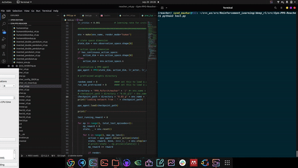
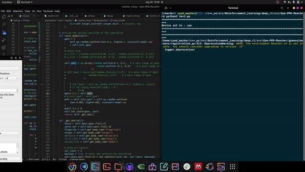

# Reinforcement Learning-Based 3DOF Arm Control

This repository contains the implementation of the Reinforcement Learning based 3 DOF arm control for goal achievement.

It uses PPO (Proximal policy optimization) to learn the right task and reward shaping to reach the goal.

The environment and the 3 DOF arm is also modeled for the experimentation of this project.

# Reach the Goal

## 2 DOF arm

## 3 DOF arm

